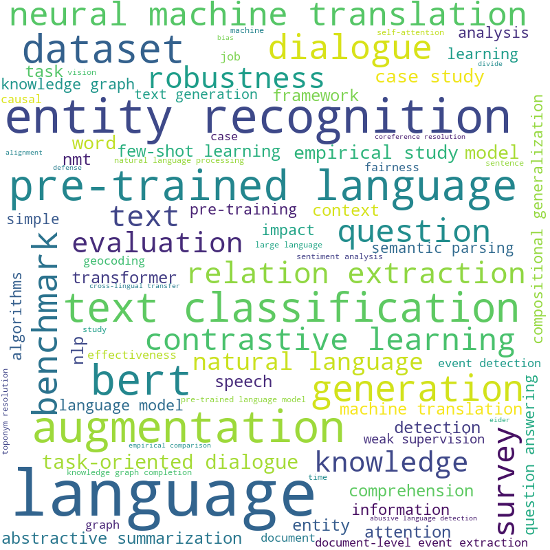

# ACLToolBox

This program had scraped the [ACL][ACL] avaliable papers for user to easily look up the paper with keyword and get the relavent information. 

Doing the analyics of the ACL paper from all the months(will keep updated) we have also provide the analystics of the recent months of Natural Language Programming topics with the wordcloud.

## Installation 
Clone the repository: 

	git clone https://github.com/eric-ai-lab/ACLToolBox.git
	cd ACLToolBox

To make sure that you have the same environment that the program needs: 

	pip install -r requirements.txt

We will maintain the newest updates consistently,

**(Optional)** to get the latest database you can run the `scraping.py`:

	./scraping.py 

You can query right out of the box by doing the following:

For querying the database for specific keyword (first letter needs to be capitalized): 

	./main.py  -month [month|all] -keyword [keyword]

This will output the pdf, forum and any additional information in a csv file in the current directory. 

## Analysis 
We have taken all the title of the recent months papers to find the keyword and keyphrase to analyze how often they come up with the paper's topic. 

## Example
For example, you want to find papers that are related to "Entity Recognition" in all the months present:

	./main.py  -month all -keyword Entity Recognition

The result will save in `result.csv` in the current directory which includes title, abstract, pdf link, and additional software, code. 

[ACL]: https://openreview.net/group?id=aclweb.org/ACL/ARR/2021&referrer=%5BHomepage%5D(%2F)
